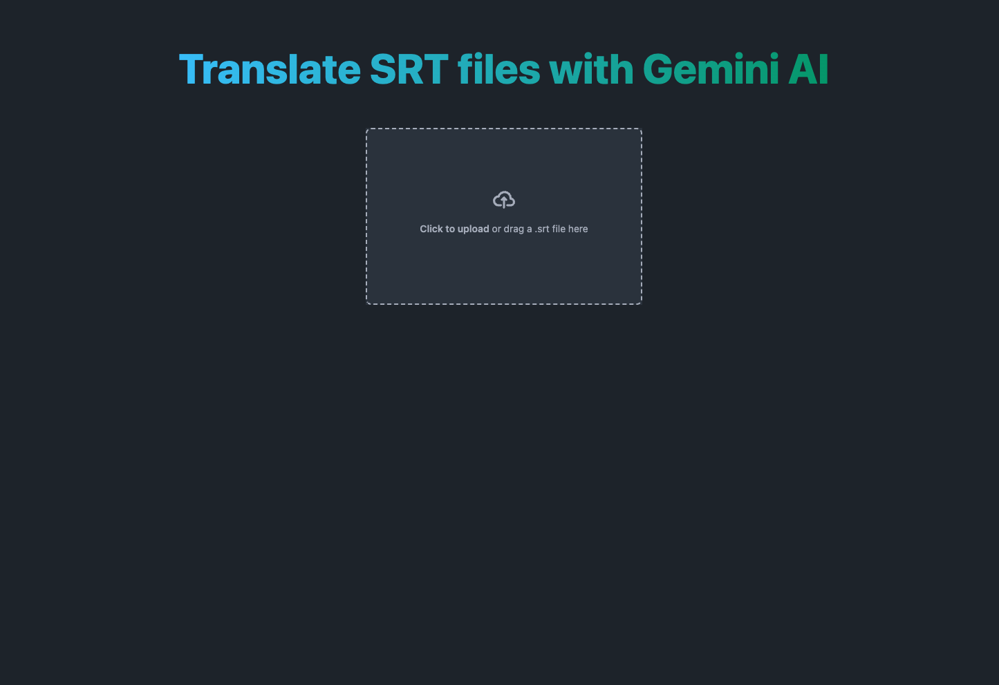

# Translate SRT files with Gemini AI

## Introduction

This Angular app translates subtitles in SRT format using Gemini AI. The translated result can be edited before exporting as an SRT file. The app is built using Angular for the frontend, Tailwind CSS for styling, and Gemini AI for translation services.

## Screenshots

<div style="display: flex; flex-wrap: wrap; gap: 10px; margin-bottom: 10px">
  
  
  
  
</div>

## Features

- File Upload: Allows users to upload an SRT file for translation.
- Translation: Interacts with Gemini AI to perform the subtitle translation.
- Editor: Edit translated subtitles.
- Export: Enables users to export the edited subtitles as an SRT file.

## Getting Started

### Prerequisites

- Gemini AI API Key (get one [here](https://aistudio.google.com/app/apikey))
- Node.js and npm installed

### Installation

1. Clone the repository:

```
  git clone https://github.com/leurisvg/pokedex.git
```

2. Set your API Key:

Rename `environment.model.ts` to `environment.ts` and paste your API Key.

2. Install dependencies:

```
  npm install
```

3. Run the Development Server:

```
  npm run dev
```

4. Open the App:

Open your web browser and navigate to http://localhost:4200 to view the app.
